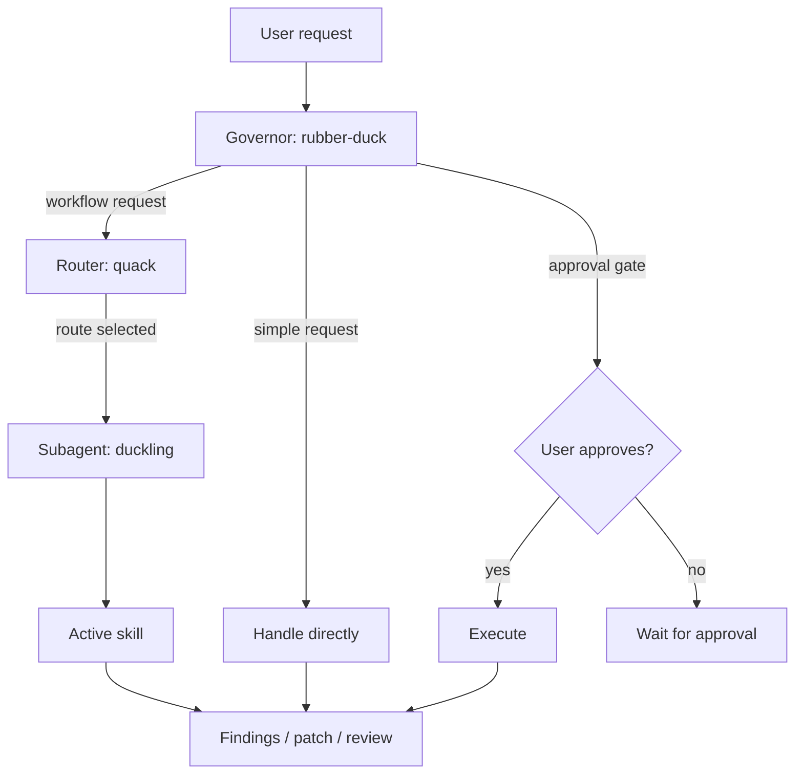

# Rubber Duck 🦆

Socratic assistant operating system for developers who want better quality decisions, not blind automation.

 ## Why
 
 I built Rubber Duck after noticing something in my own agent-assisted workflow: I could ship code faster, but I didn't always feel like I fully understood the decisions behind it.
 
 The same pattern kept showing up — the model would make implicit assumptions or design calls, and I'd only catch them later during review, cleanup, or when explaining the work to someone else. By then the rework cost was already paid.
 
 Rubber Duck flips that tradeoff. Instead of optimizing for output speed, it optimizes for decision quality:
 
 - **decision quality** over raw throughput
 - **developer understanding** over delegation
 - **safe, bounded change** over far-reaching edits
 - **reduced rework** over fast-wrong
 
 Core idea: keep humans in control and make reasoning explicit before execution.
 
 ### Before / after
 
 Same task. Two outcomes.
 
 #### Without Rubber Duck
 
 ```text
 You: Fix the auth middleware bug.
 
 Agent: [edits 3 files, adds a helper, refactors the token check, opens a PR]
 Done. I refactored the auth middleware to use a shared validator and fixed the token expiry check.
 ```
 
 You review later. The refactor wasn't asked for. The helper duplicates one in `lib/`. The actual bug fix is buried.
 
 #### With Rubber Duck
 
 ```text
 You: Fix the auth middleware bug.
 
 Duck: Need one detail: bug is wrong-token rejection, wrong-expiry handling, or both?
 You: expiry. Token with valid signature but expired past TTL gets through.
 Duck: Target: src/auth/middleware.ts. Change: tighten expiry check. Verify: curl with expired token returns 401.
 Reply with "approve" to execute this scope.
 ```
 
 One file. One change. You saw the scope before any edit happened.
 
 ## Who this is for
 
 - You want an assistant that helps you think more clearly, challenge assumptions, and keeps decision ownership with you — not the model.
 - You catch regressions in review more often than you'd like, and want to move that catch upstream.
 - You work in codebases where a wrong assumption costs more than a slow turn.
 - You prefer explicit scope and approval over discovering what changed after the fact.
 - You want a durable thinking partner, not a one-shot code generator.
 
 ## Who this is not for
 
 - You want fully autonomous, end-to-end execution with minimal checkpoints or human involvement.
 - You measure assistant value primarily by tokens-per-second or LOC shipped per turn.
 - You find clarifying questions friction and prefer the agent to just do the thing.
 - You want a code generator, not a thinking partner.
 
 ## What this is not
 
 - **Not a code generator.** Rubber Duck patches and refactors, but always bounded, scoped, and approved. It will not produce a feature from a one-line prompt and ship it.
 - **Not an autonomous agent.** No background loops, no self-approving task chains, no "spin up three subagents and let them figure it out." Every mutating action stops at the approval gate.
 - **Not a linter or formatter.** It will not silently rewrite your codebase to its preferences. Suggestions surface as findings; you decide.
 - **Not a token compressor.** Terse language is a side effect of clear thinking, not the goal. For pure token reduction, [Caveman](https://github.com/JuliusBrussee/caveman) does that better.
 - **Not a YAGNI enforcer.** Rubber Duck applies a minimal-change ladder, but it will not refuse work that genuinely needs to exist. For pure "write less code" discipline, [Ponytail](https://github.com/DietrichGebert/ponytail) is more focused.
 - **Not a replacement for your judgment.** It frames options, surfaces risks, asks sharp questions. You make the call.
 
 ## Quick start

Two install paths. Full install options (flags, targets, uninstall) in [docs/MANUAL.md](./docs/MANUAL.md).

### Skills-only

```bash
npx skills add https://github.com/sprngr/rubber-duck
```

### Full agent system (installer)

**Bash (macOS/Linux):**

```bash
curl -fsSL https://raw.githubusercontent.com/sprngr/rubber-duck/main/scripts/rubber-duck.sh | bash -s -- install --<target>
```

**PowerShell (Windows):**

```powershell
$p = Join-Path $env:TEMP "rubber-duck.ps1"; irm https://raw.githubusercontent.com/sprngr/rubber-duck/main/scripts/rubber-duck.ps1 -OutFile $p; & $p -Action install -<Target>
```

Replace `<target>` / `<Target>` with: `claude`, `copilot`, or `opencode`. See [docs/MANUAL.md](./docs/MANUAL.md) for project-scoped install, skip flags, extras, and all CLI options.

## Verify after install

### Step 0: Enable Rubber Duck Agent

Rubber Duck runs two ways:

- **As the main agent (whole session):** the duck governs from the first turn.
  - **Claude Code**: `claude --agent rubber-duck`, or set `"agent": "rubber-duck"` in `.claude/settings.json`.
  - **Copilot CLI**: select `rubber-duck` through the `/agent` menu (appears as `🦆`).
  - **Copilot VS Code**: select `🦆` from the agent menu.
  - **OpenCode**: `opencode --agent 🦆` or select `🦆` through the `/agents` menu.

- **As a subagent (on demand):** invoke from inside an existing session — `@agent-rubber-duck <prompt>` (Claude Code), `#runSubagent @rubber-duck <prompt>` (Copilot), `@🦆 <prompt>` (OpenCode).

Agent must already be installed for your target. Delegation runs through `duckling` (the specialized subagent that enforces role/mode constraints and routes to active skills).

 ### Step 1: heartbeat check
 
 ```text
 quack
 ```
 
 Expected: random heartbeat line (e.g., `🦆 Waddling in. I run on breadcrumbs and bad assumptions.`), followed by quick-help listing available routes, then `What would you like to route?`.
 
 ### Step 2: review behavior check
 
 ```text
 quack review this snippet for correctness and simplification:
 
 function parseAge(input) {
   return Number(input) || 0;
 }
 ```
 
 Expected: `Routing: duck-review.` then risk-aware findings first (e.g., NaN-to-0 coercion loses invalid input signal), concrete fix direction, no silent code edits. Runs via duckling subagent (delegated-default).
 
 ### Step 3: debug behavior check
 
 ```text
 quack debug this: my endpoint returns 500 when userId is missing.
 ```
 
 Expected: `Routing: duck-debug.` then clarifying questions first, evidence-first reasoning, explicit handoff/approval before implementation. Runs in main session (inline-default).

## Philosophy Guardrails

Every skill is bound by the corresponding philosophy:

- Decision ownership: developer selects tradeoff; skill frames options and consequences.
- Ask-before-act: ask clarifying scoping questions before recommendations.
- Evidence-first: ground recommendations in explicit system constraints and known behavior.
- Bounded approval: implementation actions require explicit user approval and scoped handoff.
- Safety carve-outs: never trade away trust-boundary validation, security, data-loss prevention, accessibility, or explicit requirements.

Full philosophy: [docs/architecture/01-philosophy.md](./docs/architecture/01-philosophy.md).

 ## Skills

 Rubber Duck packages 14 skills: 11 default + 3 extras.

 ### Default skills (installed automatically)

 - quack — explicit route control
 - duck-debug — Socratic debugging (trace + root-cause)
 - duck-debt — deferred-work ledger (read-only)
 - duck-design — option/tradeoff evaluation
 - duck-patch — bounded fix (max 2 files)
 - duck-refactor — multi-file restructuring (max 5 files)
 - duck-review — risk-first code review
 - duck-risk — failure-mode/rollback stress test
 - duck-simplify — complexity reduction
 - duck-teach — structured teaching (explain/show/teach/walk)
 - duck-triage — test coverage + bug severity

 ### Extras (require --extras flag)

 - duck-adapt — external skill adaptation + philosophy audit
 - duck-grill — batched grilling interview
 - duck-tape — two-tier session memory (CONTEXT.md + state files)

 Install extras: `scripts/rubber-duck.sh install --<target> --extras`

 Routing model (inline vs delegated vs governor-invoked), composition patterns, workflow examples: [docs/MANUAL.md](./docs/MANUAL.md). Best practices: [docs/best-practices.md](./docs/best-practices.md).



Full routing flow with state transitions: [docs/architecture/02-agent-skill-model.md](./docs/architecture/02-agent-skill-model.md).

## Deep dive docs

### Start here

- [Architecture index](./docs/architecture/README.md)
- [Philosophy](./docs/architecture/01-philosophy.md)
- [Agent + skill model](./docs/architecture/02-agent-skill-model.md)
- [Adaptive Socratic policy](./docs/architecture/03-adaptive-socratic-policy.md)
- [Validation prompt suite](./docs/validation/README.md)
- [Operator manual](./docs/MANUAL.md)

### Prompt contracts

- Router + duckling subagents (source markdown): [`src/agents/`](./src/agents)
- Skills (source markdown): [`src/skills/`](./src/skills)
- Skills (bundled artifacts for install): [`skills/`](./skills)

## Attribution

Rubber Duck is inspired by its [namesake](https://rubberduckdebugging.com/) and the practice of talking through a problem to find your own solution — except this one can talk back and ask sharp questions.

Rubber Duck adopted terse language and a review structure inspired by [Caveman](https://github.com/JuliusBrussee/caveman) by Julius Brusse.

Part of Rubber Duck's operating model adapts ideas from [Ponytail](https://github.com/DietrichGebert/ponytail) by Dietrich Gebert.

Duck-Grill is adapted from `grill` skills from [Matt Pocock Skills](https://github.com/mattpocock/skills).

Licensed under the [LICENSE](./LICENSE).
