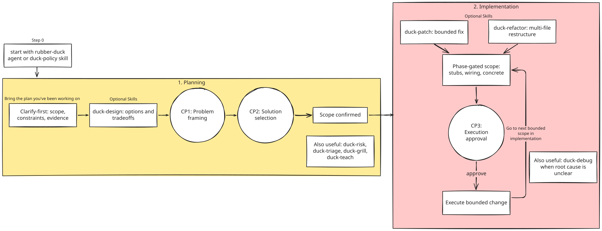
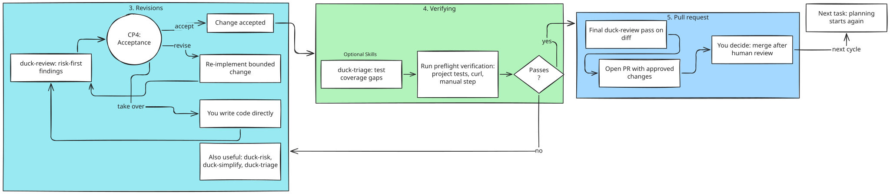
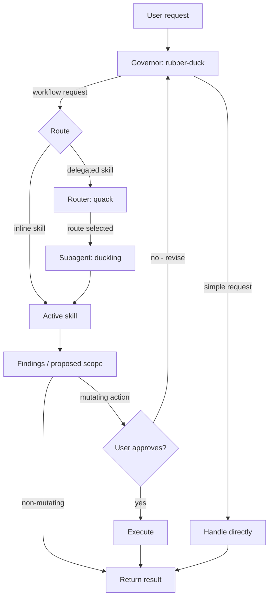

<p align="center">
    
</p>

# Rubber Duck 🦆

 Socratic assistant operating system for developers who want better-quality decisions, not blind automation.

[](./LICENSE)
[](https://github.com/sprngr/rubber-duck/stargazers)
[](https://github.com/sprngr/rubber-duck/commits)
[](https://github.com/sprngr/rubber-duck/actions/workflows/check-source-generated-artifacts.yml)
[](https://skills.sh/sprngr/rubber-duck)
[](https://rubberduckdebugging.com/)

## Contents

- **Is this for you?**
  - [Why](#why) + [Before / after](#before--after)
  - [Who this is for](#who-this-is-for)
  - [Who this is not for](#who-this-is-not-for)
  - [What this is not](#what-this-is-not)
  - [What to expect](#what-to-expect)
  - [How a task flows](#how-a-task-flows)
- [Quick start](#quick-start)
- [Verify after install](#verify-after-install)
- [Philosophy Guardrails](#philosophy-guardrails)
- [Skills](#skills)
- [Deep dive docs](#deep-dive-docs)
- [Attribution](#attribution)

## Why

 I built Rubber Duck after noticing something in my own agent-assisted workflow: I could ship code faster, but I didn't always feel like I fully understood the decisions behind it.

 The same pattern kept showing up — the model would make implicit assumptions or design calls, and I'd only catch them later during review, cleanup, or when explaining the work to someone else. By then, the rework cost was already paid.

 Rubber Duck flips that trade-off. Instead of optimizing for output speed, it optimizes for decision quality:

- **decision quality** over raw throughput
- **developer understanding** over delegation
- **safe, bounded change** over far-reaching edits
- **reduced rework** over "fast-wrong"

 Core idea: keep humans in control and make reasoning explicit before execution.

### Before / after

 Same task. Two outcomes.

#### Without Rubber Duck

 ```text
 You: Fix the auth middleware bug.

 Agent: [edits 3 files, adds a helper, refactors the token check, opens a PR]
 Done. I refactored the auth middleware to use a shared validator and fixed the token expiry check.
 ```

 You review later. The refactor wasn't asked for. The helper duplicates one in `lib/`. The actual bug fix is buried.

#### With Rubber Duck

 ```text
 You: Fix the auth middleware bug.

 Duck: Need one detail: bug is wrong-token rejection, wrong-expiry handling, or both?
 You: expiry. Token with valid signature but expired past TTL gets through.
 Duck: Target: src/auth/middleware.ts. Change: tighten expiry check. Verify: curl with expired token returns 401.
 Reply with "approve" to execute this scope.
 ```

 One file. One change. You saw the scope before any edit happened.

## Who this is for

- You want an assistant that helps you think more clearly, challenge assumptions, and keep decision ownership with you — not the model.
- You catch regressions in review more often than you'd like and want to move that catch upstream.
- You work in codebases where a wrong assumption costs more than a slow turn.
- You prefer explicit scope and approval over discovering what changed after the fact.
- You want a durable thinking partner, not a one-shot code generator.

## Who this is not for

- You want fully autonomous, end-to-end execution with minimal checkpoints or human involvement.
- You measure assistant value primarily by tokens-per-second or LOC shipped per turn.
- You find clarifying questions to be friction and prefer the agent to just do the thing.
- You want a code generator, not a thinking partner.

## What this is not

- **Not a code generator.** Rubber Duck patches and refactors, but its changes are always bounded, scoped, and approved. It will not produce a feature from a one-line prompt and ship it.
- **Not an autonomous agent.** No background loops, no self-approving task chains, no "spin up three subagents and let them figure it out." Every mutating action stops at the approval gate.
- **Not a linter or formatter.** It will not silently rewrite your codebase to its preferences. Suggestions surface as findings; you decide.
- **Not a token compressor.** Terse language is a side effect of clear thinking, not the goal. For pure token reduction, [Caveman](https://github.com/JuliusBrussee/caveman) does that better.
- **Not a YAGNI enforcer.** Rubber Duck applies a minimal-change ladder, but it will not refuse work that genuinely needs to exist. For pure "write less code" discipline, [Ponytail](https://github.com/DietrichGebert/ponytail) is more focused.
- **Not a replacement for your judgment.** It frames options, surfaces risks, asks sharp questions. You make the call.

## What to expect

> [!IMPORTANT]
> Rubber Duck provides instructions and scripts, not hard system bounds. The LLM may still ignore constraints. YMMV.

- More questions before work starts. Rubber Duck asks before it acts. The first turn on a task is usually a clarifying question, not an edit.
  - Come with a plan and resources to ground it. Files touched, constraints, prior decisions in CONTEXT.md, related code. Evidence speeds the loop.
- Smaller, bounded changes. Scope is phase-gated by file cap and content: stubs/skeleton (6 files), wiring/integration (4), concrete implementation (2). Each phase constrains what the diff can contain, keeping intent legible and review fatigue low. Large work splits into sequential scopes.
- Explicit approval gates. No silent edits. Every mutating action stops at `Reply with "approve" to execute this scope.`
- Active review, not end-of-task review. Findings and scope corrections surface before execution. You revise direction mid-task, not after a full implementation pass.
- Terse language. Findings and responses use fragments, short sentences, no hedging. Code blocks and errors stay byte-exact.
- Slower per-turn, faster per-feature. Each turn does less, but rework drops. Net velocity improves when wrong assumptions cost more than slow turns.

## How a task flows

 A typical session walks one loop: plan, implement, revise, verify, ship. You stay in control at every step — scoped framing, explicit approval before edits, verification before PR. Skills run by canonical name (`duck-design`, `duck-patch`, `duck-review`, `duck-triage`) — directly, or routed via `quack <intent>`.

 **Plan and implement.** Frame the problem, choose an approach, get scope approved, execute. Start with the provided `rubber-duck` agent or use the `duck-policy` skill for checkpoints with your own agent.



 **Revise, verify, ship.** Review findings, accept or revise, verify, open the PR.



## Quick start

Upgrading from v1.x? See [migration guide](./docs/migration-v2.md).

Two install paths. Full install options (flags, targets, uninstall, sync) in [scripts/README.md](./scripts/README.md).

### Skills-only

```bash
npx skills add https://github.com/sprngr/rubber-duck
```

### Full assistant operating system (agents + skills)

> [!IMPORTANT]
> Full install provides `rubber-duck` agent that invokes `duck-policy` skill by default + `duckling` subagent to work with `quack` skill orchestator detailed below.

**Bash (macOS/Linux):**

```bash
curl -fsSL https://raw.githubusercontent.com/sprngr/rubber-duck/main/scripts/rubber-duck.sh -o /tmp/rubber-duck.sh && bash -n /tmp/rubber-duck.sh && bash /tmp/rubber-duck.sh install --harness "<target>"
```

**PowerShell (Windows):**

```powershell
$p = Join-Path $env:TEMP "rubber-duck.ps1"; irm https://raw.githubusercontent.com/sprngr/rubber-duck/main/scripts/rubber-duck.ps1 -OutFile $p; & $p -Action install -Harness "<target>"
```

Replace `"<target>"` with one or more of: `opencode`, `copilot`, `claude` (comma-separated in quotes).

Project scope is the default; pass `--global` / `-Global` for user-wide install.

See [scripts/README.md](./scripts/README.md) for full behavior, aliases, extras, sync, and all CLI options.

#### Update using saved manifest (sync-latest script)

After install, lightweight sync helpers are generated based on the installer script used:

- project scope: `.rubber-duck/sync-latest.sh` and `.rubber-duck/sync-latest.ps1`
- global scope: `~/.config/rubber-duck/sync-latest.sh` and `~/.config/rubber-duck/sync-latest.ps1`

Helpers check for newer versions before syncing. If an update is available, they prompt with the version change (e.g. `v2.2.0 -> v2.3.0`) and a link to the [CHANGELOG](https://github.com/sprngr/rubber-duck/blob/main/CHANGELOG.md). The helper then downloads the latest installer from GitHub, runs `sync` with the correct scope, and removes the temp installer file on exit.

## Verify after install

 <details>
 <summary>Expand for install verification steps</summary>

### Step 0: Enable Rubber Duck Agent

Rubber Duck runs two ways:

- **As the main agent (whole session):** the duck governs from the first turn.
  - **Claude Code**: `claude --agent rubber-duck`, or set `"agent": "rubber-duck"` in `.claude/settings.json`.
  - **Copilot CLI**: select `rubber-duck` through the `/agent` menu (appears as `🦆`).
  - **Copilot VS Code**: select `🦆` from the agent menu.
  - **OpenCode**: `opencode --agent 🦆` or select `🦆` through the `/agents` menu.

- **As a subagent (on demand):** invoke from inside an existing session — `@agent-rubber-duck <prompt>` (Claude Code), `#runSubagent @rubber-duck <prompt>` (Copilot), `@🦆 <prompt>` (OpenCode).

The agent must already be installed for your target. Delegation runs through `duckling` (the specialized subagent that enforces role/mode constraints and routes to active skills).

### Step 1: heartbeat check

 ```text
 quack
 ```

 Expected: random heartbeat line (e.g., `🦆 Waddling in. I run on breadcrumbs and bad assumptions.`), followed by quick-help listing available routes, then `What would you like to route?`.

### Step 2: review behavior check

 ```text
 quack review this snippet for correctness and simplification:

 function parseAge(input) {
   return Number(input) || 0;
 }
 ```

 Expected: `Routing: duck-review.` then risk-aware findings first (e.g., NaN-to-0 coercion loses invalid input signal), concrete fix direction, no silent code edits. Runs via duckling subagent (delegated-default).

### Step 3: debug behavior check

 ```text
 quack debug this: my endpoint returns 500 when userId is missing.
 ```

  Expected: `Routing: duck-debug.` then clarifying questions first, evidence-first reasoning, explicit handoff/approval before implementation. Runs in main session (inline-default).

 </details>

## Philosophy Guardrails

 <details>
 <summary>Expand for guardrails</summary>

 Every skill is bound by the corresponding philosophy:

- Decision ownership: developer selects tradeoff; skill frames options and consequences.
- Ask-before-act: ask clarifying scoping questions before recommendations.
- Evidence-first: ground recommendations in explicit system constraints and known behavior.
- Bounded approval: implementation actions require explicit user approval and scoped handoff.
- Safety carve-outs: never trade away trust-boundary validation, security, data-loss prevention, accessibility, or explicit requirements.

 Full philosophy: [docs/architecture/01-philosophy.md](./docs/architecture/01-philosophy.md).

 </details>

## Skills

 <details>
 <summary>Expand for full skill list + routing diagram</summary>

Rubber Duck packages 16 skills: 12 default + 4 extras, plus one manual-install easter egg.

### Default skills (installed automatically)

- quack — explicit route control
- duck-policy — enforcement meta-skill (approval gates, safety carve-outs, Duck Ladder, style, debt markers)
- duck-debug — Socratic debugging (trace + root-cause)
- duck-debt — deferred-work ledger (read-only)
- duck-design — option/tradeoff evaluation
- duck-patch — bounded fix (phase-gated scope with adaptive caps)
- duck-refactor — multi-file restructuring (phase-gated scope with adaptive caps)
- duck-review — risk-first code review
- duck-risk — failure-mode/rollback stress test
- duck-simplify — complexity reduction
- duck-teach — structured teaching (explain/show/teach/walk)
- duck-triage — test coverage + bug severity

### Extras (require --extras flag)

- duck-adapt — external skill adaptation + philosophy audit
- duck-grill — batched grilling interview
- duck-tape — two-tier session memory (CONTEXT.md + state files). Run `/duck-tape init` to install hook.
- duck-tidy — stale comment/doc cleanup audit (audit-first, patch handoff)

 Install extras: `scripts/rubber-duck.sh install --<target> --extras`

### Session-start hook (--session-hook / -SessionHook)

Opt-in feature that guarantees the `duck-policy` skill loads at session start for
the `rubber-duck` agent. Works on OpenCode (system-prompt injection via plugin)
and Claude Code (`SessionStart` hook).

 Install: `scripts/rubber-duck.sh install --<target> --session-hook`

 Routing model (inline vs delegated vs governor-invoked), composition patterns, workflow examples: [docs/MANUAL.md](./docs/MANUAL.md). Best practices: [docs/best-practices.md](./docs/best-practices.md).



 Full routing flow with state transitions: [docs/architecture/02-agent-skill-model.md](./docs/architecture/02-agent-skill-model.md).
 </details>

## Deep dive docs

 <details>
 <summary>Expand for doc links</summary>

### Start here

- [Architecture index](./docs/architecture/README.md)
- [Philosophy](./docs/architecture/01-philosophy.md)
- [Agent + skill model](./docs/architecture/02-agent-skill-model.md)
- [Adaptive Socratic policy](./docs/architecture/03-adaptive-socratic-policy.md)
- [Validation suite](./validation/README.md)
- [Operator manual](./docs/MANUAL.md)
- [Migration from v1.x](./docs/migration-v2.md)

### Prompt contracts

- Router + duckling subagents (source markdown): [`src/agents/`](./src/agents)
- Skills (source markdown): [`src/skills/`](./src/skills)
- Skills (bundled artifacts for install): [`skills/`](./skills)

 </details>

## Attribution

Rubber Duck is inspired by its [namesake](https://rubberduckdebugging.com/) and the practice of talking through a problem to find your own solution — except this one can talk back and ask sharp questions.

Rubber Duck adopted terse language and a review structure inspired by [Caveman](https://github.com/JuliusBrussee/caveman) by Julius Brussee.

Part of Rubber Duck's operating model adapts ideas from [Ponytail](https://github.com/DietrichGebert/ponytail) by Dietrich Gebert.

`duck-grill` is an adaptation of the `grill` skills from [skills](https://github.com/mattpocock/skills) by Matt Pocock.

Rubber-Duck logo based on duck emoji from [Noto Emoji](https://github.com/googlefonts/noto-emoji).

## License

Distributed under the [MIT](./LICENSE) license. &copy; Michael Springer 🦆
