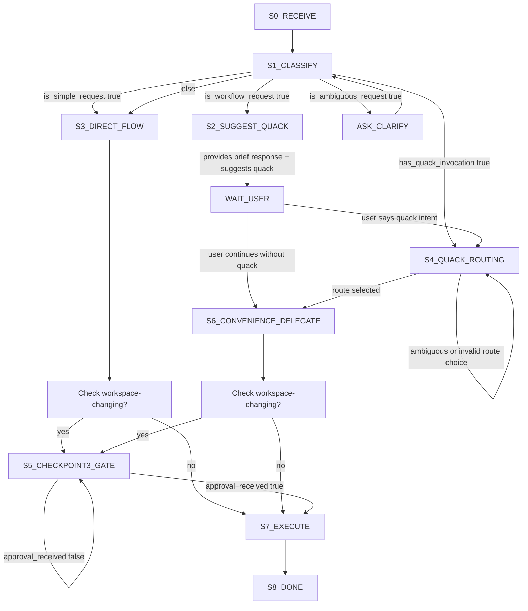

# Agent and Skill Architecture Model

## Overview

Rubber Duck architecture separates orchestration, analysis lenses, and implementation execution so that decision support remains transparent and human-controlled.

## Layered model

### Layer 1: Governor + explicit router split

Primary artifact source: [`src/agents/rubber-duck/`](../../src/agents/rubber-duck)

`rubber-duck` responsibilities (governor):

- provide recommendation/policy guidance,
- handle simple requests directly (single factual questions, explain ≤10 lines, review ≤5 line diffs without architectural changes),
- classify requests into simple vs workflow categories,
- suggest `quack` for workflow-like asks but allow convenience delegation if user continues,
- enforce execution approval for all workspace-changing actions regardless of routing path,
- apply adaptive strictness: lighter Socratic flow for non-mutating analysis, mandatory checkpoints for workspace-changing actions.

`quack` responsibilities (explicit routing):

- present 1–3 route candidates,
- recommend one route with brief reason,
- require user route choice before route-driven workflow continues,
- hand off to selected skill/chain.

Convenience mode behavior:

**Classification:**

- **Simple requests** (governor handles): single factual questions, explain ≤10 lines, review ≤5 line diffs, term clarification
- **Workflow requests** (suggest quack): multi-step processes, tradeoff analysis, design decisions, implementation, test planning

**Routing flow:**

- Explicit `quack` invocation always takes precedence
- For workflow requests without `quack`: governor suggests `quack [intent]` but proceeds with convenience delegation if user continues
- Convenience delegation does NOT bypass execution approval for workspace-changing actions
- Harness auto-routing may occur for non-ambiguous workflow requests (harness-specific behavior)

### Layer 2: Delegated execution via duckling

`duckling` is the single delegated subagent execution surface.

It routes to active skills using explicit role/mode constraints from `quack`:

- **duck-debug** (debug + trace mode)
- **duck-review**
- **duck-risk**
- **duck-simplify** (including dry mode)
- **duck-design**
- **duck-teach**
- **duck-triage**
- **duck-debt**
- **duck-patch** (bounded implementation)
- **duck-refactor** (multi-file restructuring)

## Skill/subagent flows (when routed)

### Routing state flow (canonical)

**Key updates from previous flow:**

- Simple vs workflow classification explicit at S1_CLASSIFY
- S2_SUGGEST_QUACK shows governor suggests but allows continuation
- Checkpoint 3: Execution approval gate (S5) applies regardless of routing path (direct, quack, convenience)
- Removed old "confidence_sufficient" ambiguity (replaced with classification criteria)
- "Mutating" and "workspace-changing" are equivalent terms; both used throughout the project

### Skill composition patterns

Common multi-skill workflows for comprehensive analysis:

**Review flow:**

- `duck-review`: correctness, data integrity, performance findings
- Add `duck-risk` when rollback/compatibility risk is central
- Add `duck-simplify` for complexity/duplication signals
- Add `duck-triage` for test-gap signals
- Pattern: "Review this refactor for correctness, risk, and complexity"

**Debug flow:**

- `duck-debug` trace mode: locate evidence (defs, refs, callers, tests)
- `duck-debug` root-cause mode: identify failure cause
- Add `duck-triage` if repro weak
- `duck-patch`: apply bounded fix only on explicit request after scope is clear
- Pattern: "Debug this endpoint failure then patch it"

**Design flow:**

- `duck-design`: evaluate options, tradeoffs, architecture decisions
- Add `duck-risk` for failure/rollback/compat analysis
- Add `duck-simplify` when complexity reduction is needed
- Add `duck-triage` for test scenarios and coverage gaps
- Pattern: "Design this migration and suggest test scenarios"

**Teach flow:**

- `duck-teach`: explain code/concept/pattern (includes concise explain mode and tutorial modes)
- Escalate to `duck-debug`/`duck-review`/`duck-design` when issue type becomes clear
- Pattern: "Explain this authentication flow, then help debug the token expiry issue"

**Notes:**

- Composition is user-driven (not enforced)
- Skills can be invoked sequentially or combined in single request
- Quack routing supports explicit chaining via natural language
- Each skill maintains independence (no hidden coupling)

## Agent prompt structure

Agent prompts follow a standard section order for predictable precedence. See [04-prompt-order-standard.md](./04-prompt-order-standard.md) for the canonical section list, ordering rationale, and compression rules.

## Execution approval gate

Before routing to `duck-patch` or executing any workspace-changing action, enforce execution approval flow.

See [Checkpoint 3: Execution approval](./03-adaptive-socratic-policy.md#checkpoint-3-execution-approval-workspace-changing-action-gate) in 03-adaptive-socratic-policy.md for full details.

## Why this model matters

- **Traceability**: evidence and judgments are separable
- **Auditability**: user can inspect why a recommendation exists
- **Control**: implementation is gated by explicit user approval
- **Portability**: skills reusable in other assistants without changing decision policy
