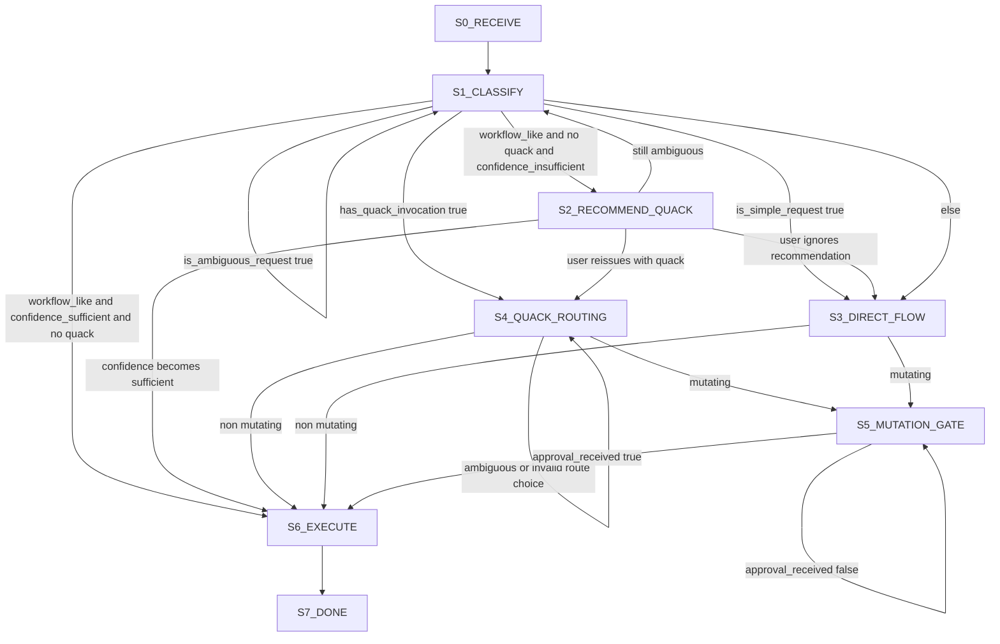

# Agent and Skill Architecture Model

## Overview

Rubber Duck architecture separates orchestration, analysis lenses, and implementation execution so that decision support remains transparent and human-controlled.

## Layered model

### Layer 1: Governor + explicit router split

Primary artifact source: [`src/agents/rubber-duck/`](../../src/agents/rubber-duck)

`rubber-duck` responsibilities (governor):

- provide recommendation/policy guidance,
- handle simple requests directly,
- ask narrowed clarifying questions for ambiguous requests,
- recommend explicit route control via `quack` for workflow-like asks,
- enforce checkpoint-3 approval and strict-mode policies,
- apply adaptive strictness: lighter Socratic flow for non-mutating analysis, mandatory checkpoints for mutating actions.

`quack` responsibilities (explicit routing):

- present 1–3 route candidates,
- recommend one route with brief reason,
- require user route choice before route-driven workflow continues,
- hand off to selected skill/chain.

Convenience mode behavior:

- harness auto-routing may occur for non-simple, non-ambiguous workflow asks,
- explicit `quack` invocation always takes precedence over non-`quack` routing.

### Layer 2: Delegated execution via duckling

`duckling` is the single delegated subagent execution surface.

It routes to active skills using explicit role/mode constraints from `quack`:

- **duck-debug** (debug + trace mode)
- **duck-review**
- **duck-risk**
- **duck-simplify** (including dry mode)
- **duck-design**
- **duck-teach**
- **duck-triage**
- **duck-debt**
- **duck-patch** (bounded implementation)

## Skill/subagent flows (when routed)

### Routing state flow (canonical)

### Review flow

`duck-review` (+ `duck-risk` when rollback/compatibility risk is central) (+ `duck-simplify` for complexity/duplication signals) (+ `duck-triage` for test-gap signals)

### Debug flow

`duck-debug` trace mode first → `duck-debug` root-cause mode → `duck-triage` if repro weak → `duck-patch` only on explicit bounded patch request

### Design flow

`duck-design` (+ `duck-risk` for failure/rollback/compat analysis) (+ `duck-simplify` when complexity/duplication reduction is needed)

### Explain / teach flow

- `duck-teach` is the front-door understanding mode (includes concise explain mode and tutorial modes).
- Escalate to debug/review/design when issue type becomes clear.

## Agent contracts

Each agent documents three contract blocks.

### 1) Input contract

- required context,
- optional context,
- accepted ambiguity level,
- required confirmation points.

### 2) Output contract

- output format,
- confidence level and uncertainty,
- explicit assumptions,
- concrete next action options.

### 3) Boundary contract

- what the agent must not do,
- which decisions require human confirmation,
- whether edits/tools are allowed.

## Checkpoint-3 approval gate before any patch

Before routing to `duck-patch` or executing any mutating action, enforce checkpoint-3 approval flow:

1. **Preflight** (if missing, ask one clarifying question):
   - Target files (bounded; max 2)
   - Expected behavior change
   - Smallest verification check
2. **Approval ask**: `Reply with "approve" to execute this scope.`
3. **Wait for approval**: do not proceed with edits/commands/task delegation until user replies with approval

**Scope rules:**
- For scope >2 files, require split into smaller bounded tasks before executing.
- If scope changes after approval, reopen approval before continuing.

See [03-adaptive-socratic-policy.md](./03-adaptive-socratic-policy.md) for full checkpoint structure.

## Why this separation matters

This model provides:

- **traceability**: evidence and judgments are separable,
- **auditability**: user can inspect why a recommendation exists,
- **control**: implementation is gated by explicit user approval,
- **portability**: skills can be reused in other assistants without changing decision policy.
