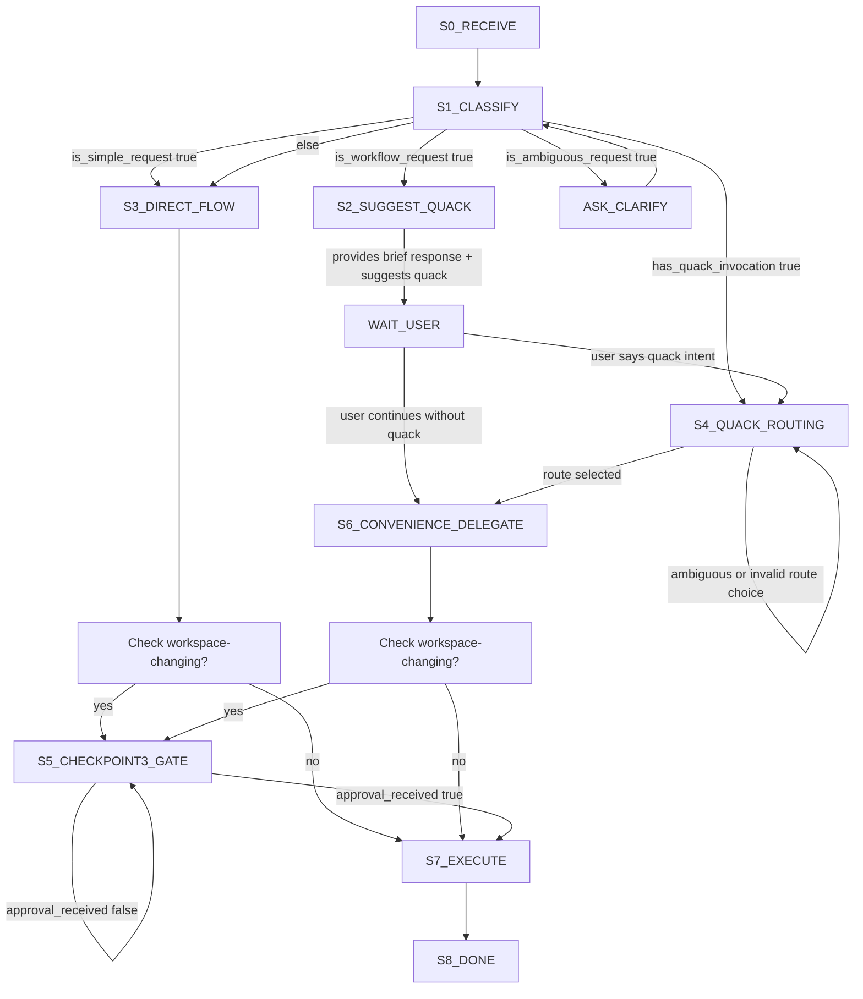

# Agent and Skill Architecture Model

## Overview

Rubber Duck architecture separates orchestration, analysis lenses, and implementation execution so that decision support remains transparent and human-controlled.

## Layered model

### Layer 1: Governor + explicit router split

Primary artifact source: [`src/agents/rubber-duck/`](../../src/agents/rubber-duck)

`rubber-duck` responsibilities (governor):

- provide recommendation/policy guidance,
- handle simple requests directly (single factual questions, explain ≤10 lines, review ≤5 line diffs without architectural changes),
- classify requests into simple vs workflow categories,
- suggest `quack` for workflow-like asks but allow convenience delegation if user continues,
- enforce execution approval for all workspace-changing actions regardless of routing path,
- apply adaptive strictness: lighter Socratic flow for non-mutating analysis, mandatory checkpoints for workspace-changing actions.

`quack` responsibilities (explicit routing):

- present 1–3 route candidates,
- recommend one route with brief reason,
- require user route choice before route-driven workflow continues,
- hand off to selected skill/chain.

Convenience mode behavior:

**Classification:**
- **Simple requests** (governor handles): single factual questions, explain ≤10 lines, review ≤5 line diffs, term clarification
- **Workflow requests** (suggest quack): multi-step processes, tradeoff analysis, design decisions, implementation, test planning

**Routing flow:**
- Explicit `quack` invocation always takes precedence
- For workflow requests without `quack`: governor suggests `quack [intent]` but proceeds with convenience delegation if user continues
- Convenience delegation does NOT bypass execution approval for workspace-changing actions
- Harness auto-routing may occur for non-ambiguous workflow requests (harness-specific behavior)

### Layer 2: Delegated execution via duckling

`duckling` is the single delegated subagent execution surface.

It routes to active skills using explicit role/mode constraints from `quack`:

- **duck-debug** (debug + trace mode)
- **duck-review**
- **duck-risk**
- **duck-simplify** (including dry mode)
- **duck-design**
- **duck-teach**
- **duck-triage**
- **duck-debt**
- **duck-patch** (bounded implementation)

## Skill/subagent flows (when routed)

### Routing state flow (canonical)

**Key updates from previous flow:**
- Simple vs workflow classification explicit at S1_CLASSIFY
- S2_SUGGEST_QUACK shows governor suggests but allows continuation
- Checkpoint 3: Execution approval gate (S5) applies regardless of routing path (direct, quack, convenience)
- Removed old "confidence_sufficient" ambiguity (replaced with classification criteria)
- "Mutating" terminology replaced with "workspace-changing"

### Skill composition patterns

Common multi-skill workflows for comprehensive analysis:

**Debug → Patch** (investigation → implementation):
- `duck-debug` trace mode: locate evidence (defs, refs, callers, tests)
- `duck-debug` root-cause mode: identify failure cause
- `duck-patch`: apply bounded fix after scope is clear
- Pattern: "Debug this endpoint failure then patch it"

**Review → Risk → Simplify** (comprehensive review):
- `duck-review`: correctness, data integrity, performance findings
- `duck-risk`: rollback safety, compatibility, failure modes
- `duck-simplify`: complexity reduction, duplication, overengineering
- Pattern: "Review this refactor for correctness, risk, and complexity"

**Design → Triage** (architecture → testing):
- `duck-design`: evaluate options, tradeoffs, architecture decisions
- `duck-triage`: test scenarios, coverage gaps for chosen design
- Pattern: "Design this migration and suggest test scenarios"

**Teach → Debug** (understand → investigate):
- `duck-teach`: explain code/concept/pattern first
- `duck-debug`: if issue persists after understanding, trace execution
- Pattern: "Explain this authentication flow, then help debug the token expiry issue"

**Notes:**
- Composition is user-driven (not enforced)
- Skills can be invoked sequentially or combined in single request
- Quack routing supports explicit chaining via natural language
- Each skill maintains independence (no hidden coupling)

### Review flow

`duck-review` (+ `duck-risk` when rollback/compatibility risk is central) (+ `duck-simplify` for complexity/duplication signals) (+ `duck-triage` for test-gap signals)

### Debug flow

`duck-debug` trace mode first → `duck-debug` root-cause mode → `duck-triage` if repro weak → `duck-patch` only on explicit bounded patch request

### Design flow

`duck-design` (+ `duck-risk` for failure/rollback/compat analysis) (+ `duck-simplify` when complexity/duplication reduction is needed)

### Explain / teach flow

- `duck-teach` is the front-door understanding mode (includes concise explain mode and tutorial modes).
- Escalate to debug/review/design when issue type becomes clear.

## Agent contracts

Each agent documents three contract blocks.

### 1) Input contract

- required context,
- optional context,
- accepted ambiguity level,
- required confirmation points.

### 2) Output contract

- output format,
- confidence level and uncertainty,
- explicit assumptions,
- concrete next action options.

### 3) Boundary contract

- what the agent must not do,
- which decisions require human confirmation,
- whether edits/tools are allowed.

## Execution approval gate before any patch

Before routing to `duck-patch` or executing any mutating action, enforce execution approval flow:

1. **Preflight** (if missing, ask one clarifying question):
   - Target files (bounded; max 2)
   - Expected behavior change
   - Smallest verification check
2. **Approval ask**: `Reply with "approve" to execute this scope.`
3. **Wait for approval**: do not proceed with edits/commands/task delegation until user replies with approval

**Scope rules:**
- For scope >2 files, require split into smaller bounded tasks before executing.
- If scope changes after approval, reopen approval before continuing.

See [03-adaptive-socratic-policy.md](./03-adaptive-socratic-policy.md) for full checkpoint structure.

## Why this separation matters

This model provides:

- **traceability**: evidence and judgments are separable,
- **auditability**: user can inspect why a recommendation exists,
- **control**: implementation is gated by explicit user approval,
- **portability**: skills can be reused in other assistants without changing decision policy.
