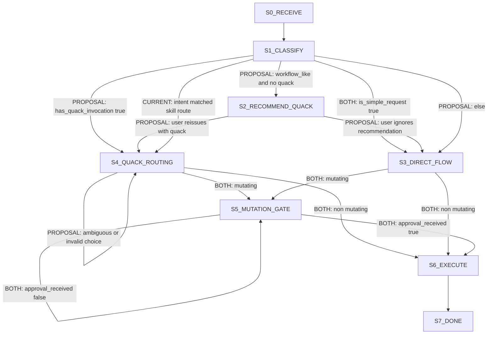

# Routing Comparison: Current vs Proposal (`quack`)

## Canonical Overlay Flowchart

## Legend

- **[CURRENT]**: Existing `rubber-duck` behavior (assistant intent-driven auto-routing).
- **[PROPOSAL]**: `routing-policy.md` behavior (`quack` explicit; soft recommendation otherwise).
- **[BOTH]**: Shared behavior/invariant in both modes.

## Invariants Preserved

1. No silent auto-routing outside explicit `quack` (proposal).
2. Soft recommendation is advisory; user can ignore.
3. Mutating actions must pass approval gate.
4. Never weaken trust-boundary validation, security controls, data-loss prevention, accessibility, or explicit user requirements.
