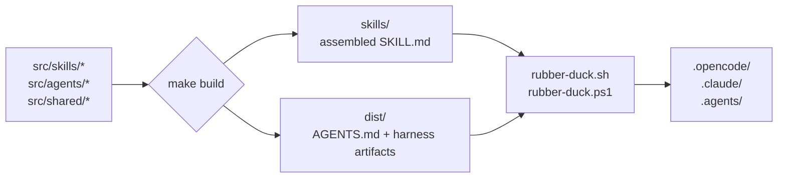

# Source to Artifact

Everything runtime-observable in rubber-duck is generated from source. Editing generated output is never the workflow.

## Flow

## Layers

- **`src/`** — source of truth. Edit here.
- **`skills/`** — assembled skill artifacts, one directory per skill with `SKILL.md` + assets. Generated by `make build-skills`.
- **`dist/`** — harness artifacts, including `dist/AGENTS.md` (the managed policy block). Generated by `make build-harness`.
- **Installers** — `scripts/rubber-duck.sh` + `scripts/rubber-duck.ps1`. Bash/PowerShell parity is enforced. They read `skills/` + `dist/`, install to `.opencode/`, `.claude/`, or `.agents/` depending on harness flag.
- **Harness runtime** — your AI tool loads `AGENTS.md` (policy) + `skills/` on session start.

## Verification

`make check` verifies:

- Skills artifacts match `src/skills/` sources.
- Harness artifacts (including managed policy block) match `src/agents/` + `src/shared/`.
- No hand-edits to generated output.

Drift-check is how the source-of-truth invariant stays enforced.
